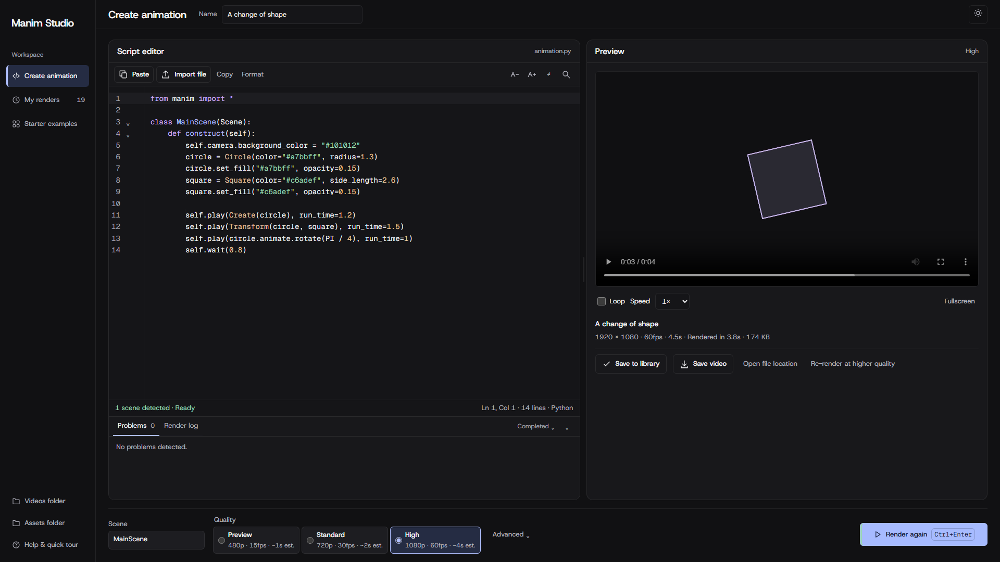

# Manim Studio

A standalone Windows app for turning Manim scripts into animations. Paste a
script, choose a scene, resolution and frame rate, then render and preview a video in one
workspace. The installer and portable edition include the rendering tools;
you do not need to install Python or run commands.



**[Download Manim Studio](https://github.com/ItsTatsuya/manim-studio/releases/latest)**
· [Report a bug](https://github.com/ItsTatsuya/manim-studio/issues)

## Install

Requires **64-bit Windows 10 (2004 or later) or Windows 11**. Allow approximately
5 GB of free space during setup. The app is currently unsigned, so Windows may
show an unrecognized-app warning. Use the downloads from this repository.

| Download                                                                                                                      | Size   | What to do                                                                                                                     |
| ----------------------------------------------------------------------------------------------------------------------------- | ------ | ------------------------------------------------------------------------------------------------------------------------------ |
| [Setup](https://github.com/ItsTatsuya/manim-studio/releases/download/v1.0.0/Manim-Studio-1.0.0-Setup-x64.exe)                 | 5.2 MB | Recommended when you have internet. Run the installer; it downloads and prepares the engine and creates a Start menu shortcut. |
| [Portable](https://github.com/ItsTatsuya/manim-studio/releases/download/v1.0.0/Manim-Studio-1.0.0-Portable-x64.zip)           | 655 MB | Extract the **entire ZIP**, then open **Manim Studio.exe**. Keep its folders together.                                         |
| [Offline setup](https://github.com/ItsTatsuya/manim-studio/releases/download/v1.0.0/Manim-Studio-1.0.0-Offline-Setup-x64.exe) | 455 MB | Run the installer without downloading the engine during setup.                                                                 |

These are the version 1.0.0 downloads. Standard animations and equations work
offline after setup. Extra TeX packages or script-specific dependencies may need
internet. Checksums are available with the release.

## Create an animation

1. Open Manim Studio. The first-run tour explains the actual buttons; replay it from Help whenever you need it.
2. Paste a complete **Manim Community** Python script, or import a `.py` file.
3. Give the animation a name. Select the scene if the script contains more than one.
4. Select the **Resolution** and **Frame rate**, then click **Render animation** or press **Ctrl+Enter**. Choose **Custom…** in either dropdown to enter other values.
5. Watch progress, play the result, save the MP4 or open its output folder. You can cancel an active render and retry after fixing an error.

Completed animations appear in **My renders** automatically. Output folders use
the animation name, with numbered suffixes for repeated names. The current
script, theme and preferences are restored when you reopen the app.

Generate scripts with your preferred AI externally, then paste them here.
Manim Studio has no AI account or API integration.

## Features

- Python editor with highlighting, autocomplete, line numbers, find, word wrap and formatting.
- Resizable editor/preview panes and render controls that stay visible.
- Problems linked to script lines, render logs and copyable error details.
- Video playback with looping, speed and fullscreen controls.
- Independent resolution and frame-rate dropdowns, including custom dimensions and fractional frame rates.
- Anchored onboarding tour, dark/light themes, and locally bundled Host Grotesk and Geist Mono fonts.
- Bundled Python 3.12, Manim Community 0.21.0, WebView2, equation support and audio tools.

MP4 is the supported output format. One render runs at a time. Custom Python
dependency management is not available in the UI.
Custom dimensions must use even pixel widths and heights for MP4 encoding.

## Your files

| Edition         | Scripts, assets and render data                           |
| --------------- | --------------------------------------------------------- |
| Installed       | `%LOCALAPPDATA%\ManimStudio\Data`                         |
| Portable        | `UserData` beside `Manim Studio.exe`                      |
| Source checkout | The checkout directory, unless `MANIM_STUDIO_DATA` is set |

Each completed render keeps `video.mp4`, `script.py`, `render.log` and
`render.json` under `outputs/studio/<animation name>/`. Place custom images and
audio in the data folder's `assets/` directory and reference them with paths
such as `assets/example.png`.

Installer upgrades and uninstalling preserve your data. When updating the
portable edition, keep its `UserData` folder.

## App updates

The installed and portable apps notify you when a newer stable GitHub release
is available. Open **Updates** to check manually, download the update, then
choose **Install and restart**. Downloads are verified against the release
checksums before installation. Save any pending work first; installation waits
until rendering has finished and preserves your scripts, preferences and history.

Automatic checks can be turned off in Updates. Downloads and installation always
require your action. Source checkouts and browser mode provide the release link
instead of installing updates. The app continues to work offline.

## Troubleshooting

- **Script error:** click the problem to jump to its line, or copy the error details to your AI to help fix the script.
- **Missing image or audio:** check that the asset exists in the app's assets folder and the script uses the correct relative path.
- **Missing equations or rendering tools:** rerun setup to repair the engine. `Text` works without LaTeX; `Tex` and `MathTex` require it.
- **Online setup reports a runtime mismatch:** use the portable or offline download. The online installer rejects native engine versions that differ from the reviewed release.
- **A very long path fails:** extract the portable app into a shorter folder.
- **Startup failure:** check `outputs/studio-startup.log` in your data directory. Include relevant error details when reporting a bug.

**Scripts run with your Windows account's permissions.** Review code before
rendering; Python scripts can access files and the network. Keep the app's
server local rather than exposing it through a public address or tunnel.

## Development

The app uses **FastAPI + Uvicorn**, **pywebview/WebView2**, and an HTML/CSS/JS
frontend with **CodeMirror 6**. Manim renders through a separate Python process
using Cairo. A C# launcher and Inno Setup produce the Windows downloads.

For source development, install Python 3.12, [uv](https://docs.astral.sh/uv/),
and Node.js 22 or newer, then run:

```powershell
uv sync --locked
npm ci
npm run build:editor
uv run python desktop.py
```

Source development needs MiKTeX for equations and FFmpeg for audio. The
standalone downloads already include these tools. Node.js is a development
tool and is not needed to use the installed app.

Run checks before submitting a change:

```powershell
uv run ruff check .
uv run ruff format --check .
npm run format:check
uv run python -m unittest discover -s tests -v
```

See [AGENTS.md](AGENTS.md) for browser checks and release-build requirements.
Bug reports and focused pull requests are welcome. Include reproduction steps
and relevant logs; remove private paths, scripts and secrets before sharing.

## Creator, credits and license

Created by **[ItsTatsuya](https://github.com/ItsTatsuya)**.

- **Manim Community and its contributors** — animation engine. [Source](https://github.com/ManimCommunity/manim).
- **FFmpeg and its contributors** — audio/video tools. [Source](https://github.com/FFmpeg/FFmpeg).

The app's own code is **[MIT licensed](LICENSE)**, copyright 2026 ItsTatsuya.
Third-party components retain their original licenses and notices. Matching
sources, patches and build recipes for FFmpeg and other bundled components
requiring source distribution are available in
[Third-Party-Sources.zip](https://github.com/ItsTatsuya/manim-studio/releases/download/v1.0.0/Manim-Studio-1.0.0-Third-Party-Sources.zip).
